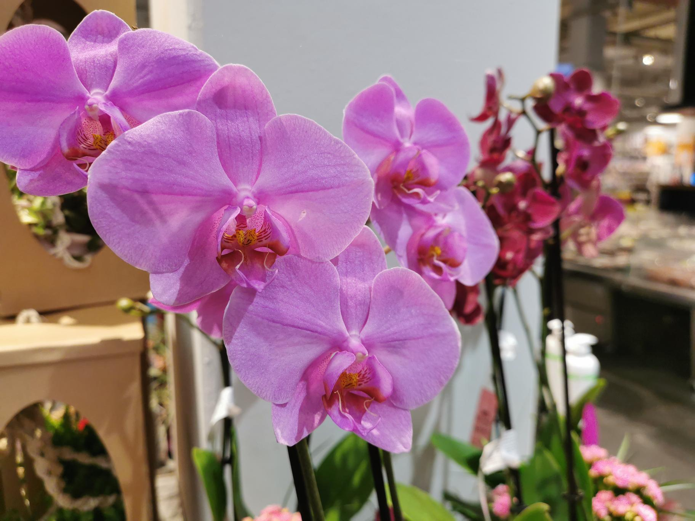

+++
title = "Webseite"
date = "2020-08-19"
draft = false
pinned = false
image = "microsoftteams-image-3-.png"
description = "Webseite erstellen"
+++
In den Lektionen zwei und drei haben wir eine Webseite erstellt. Wir durften zuerst raus gehen und Fotos für die Webseite suchen. Danach konnten wir über die Seite Carr unsere eigene Webseite erstellen. Als erstes mussten wir das Layout auswählen. Auf den drei folgenden Folien beschrieben wir unsere Firma, unsere Produkte und wie man uns finden kann. Wir waren erstaunt wie schnell und trotzdem schön man eine Webseite erstellen kann. Ich kann mir vorstellen, dass ich die neu erlernten Fähigkeiten auch mal für ein Schulprojekt anwenden werde. Am Ende konnten wir unsere Webseite präsentieren. Uns hat es gefreut, dass hauptsächlich nur positive Punkte genannt wurden. 

