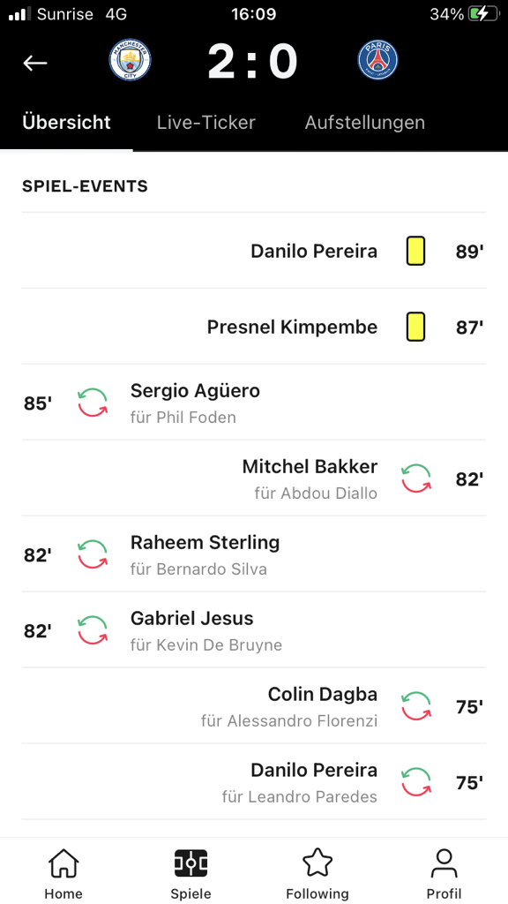
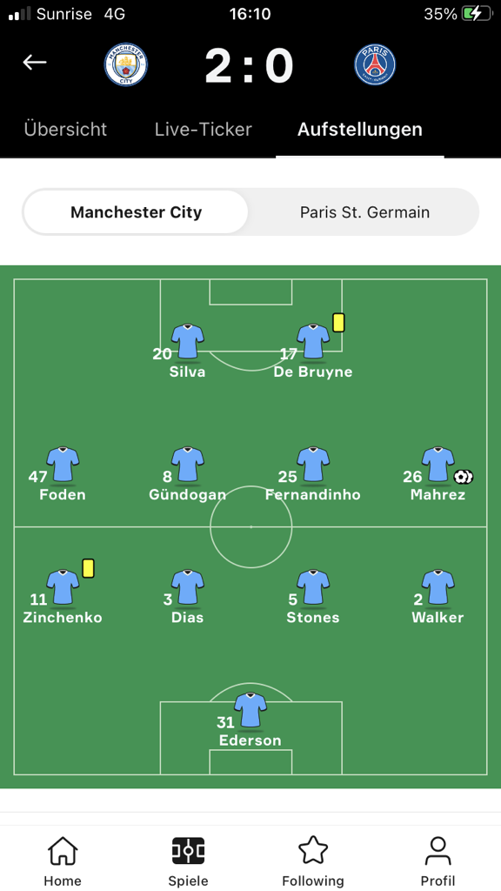
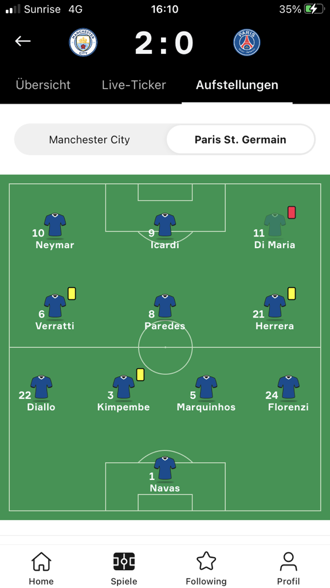
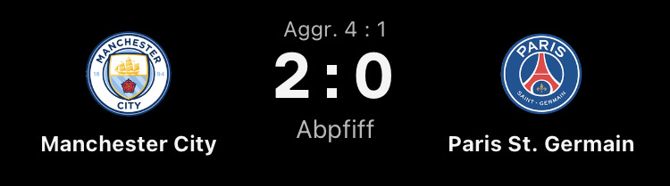
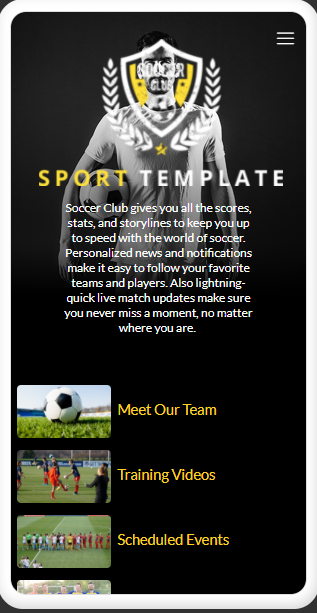
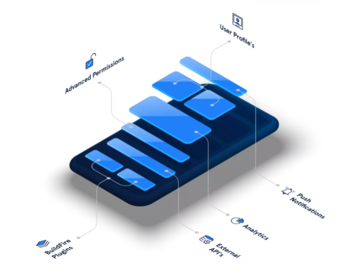
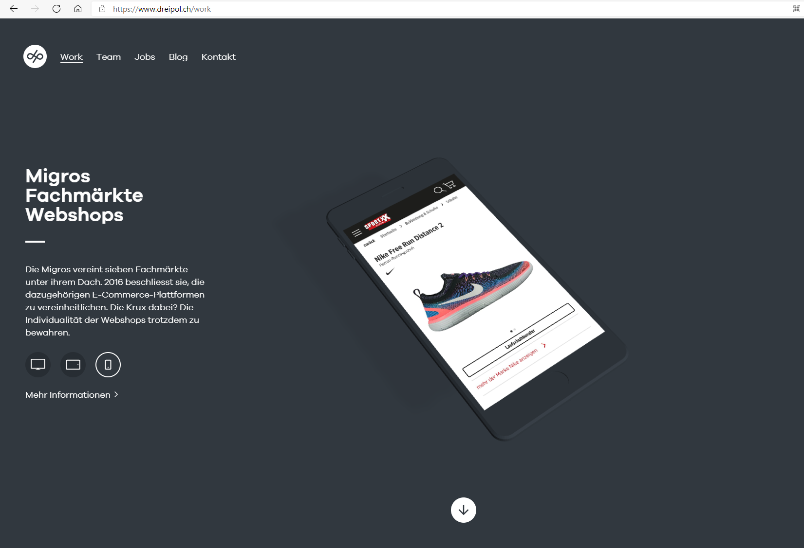
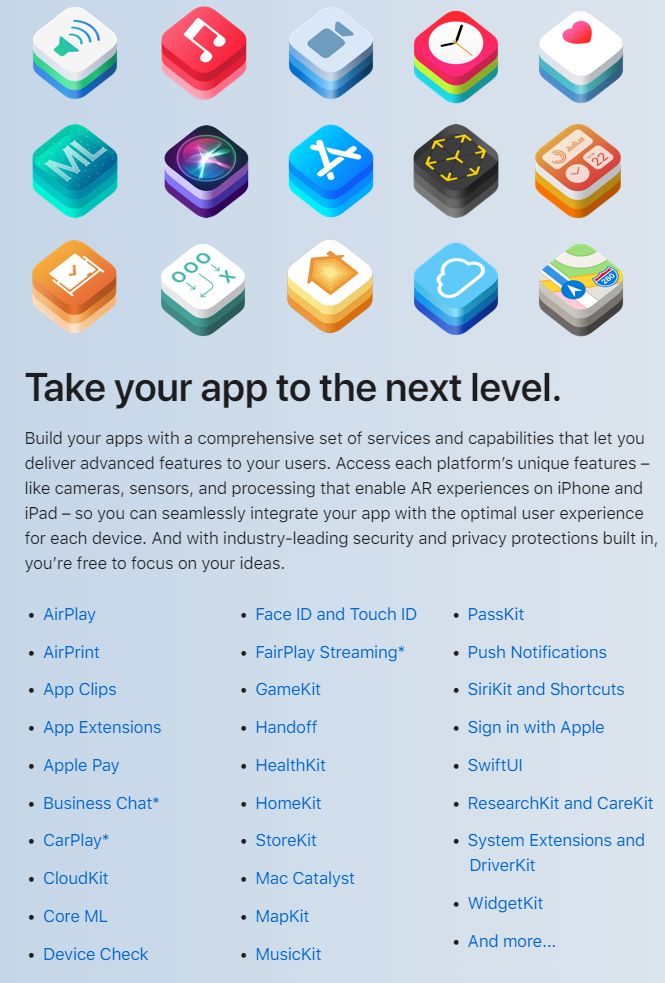

+++
title = "Die Note 6!"
date = "2021-05-26"
draft = false
pinned = false
tags = []
image = "unsere-app1.png"
description = "Nach der Diskussion mit Herrn Jakob, versuchen wir die Note 6 zu erhalten. "
+++
26.05.2021 - wir wollen die Note 6.0!

Um diese zu erreichen, wollte Herr Jakob, dass wir den Prozess unserer App, bis sie im AppStore landet aufschreiben, um zu sehen, wann unser Produkt (FussballApp) kommerziell verwertbar ist und Marco sie sich anschauen kann.

1. Unsere App

2. Womit haben wir die App erstellt?

3. Wie wird die App zu einer ios.App?

4. Wie gestalten wir sie?

5. Wie gelangt sie in den AppStore?