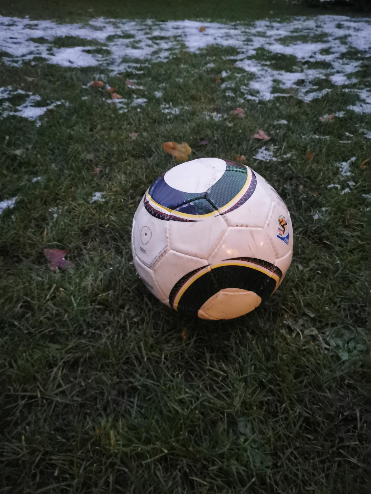

+++
title = "Gescoutete Orte"
date = "2020-12-09"
draft = false
pinned = false
image = "microsoftteams-image-3-.png"
description = "Wir haben heute vieles vor. "
+++

Wir haben heute die ersten Texte für unsere Webseite geschrieben. Wir wollten testen, ob es so umsetzbar ist, wie wir es uns vorgestellt haben. Es hat geklappt!

Zudem haben wir noch die gescouteten Plätze von letzter Woche besprochen. Wegen dem Wetter konnten wir leider nicht heute die Fotos machen. 

Heute wäre auch noch die Notenbesprechung geplant gewesen, welche aber nicht stattgefunden hat. Es gab aber leider ein Missverständnis meinerseits mit den Terminen und darum hatte ich keine Möglichkeit meine Note zu verbessern. Ich finde das ein bisschen schade, da ich das Gefühl habe meine Arbeit hätte eine bessere Note verdient. Ich hoffe, dass ich aber in bei der nächsten Note eine 5.5 erhalte um meine Leistungen gerecht zu würdigen.