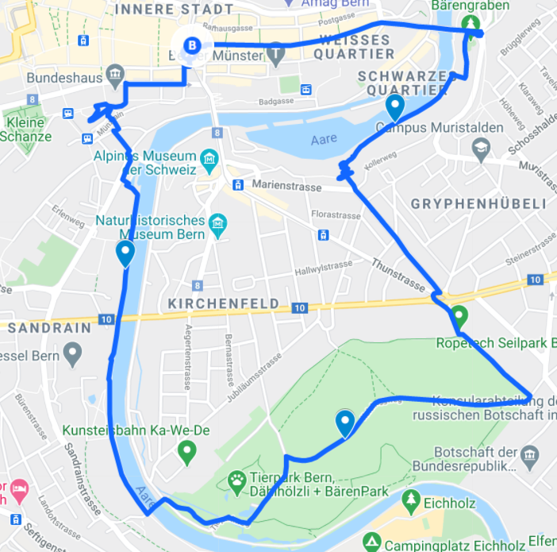
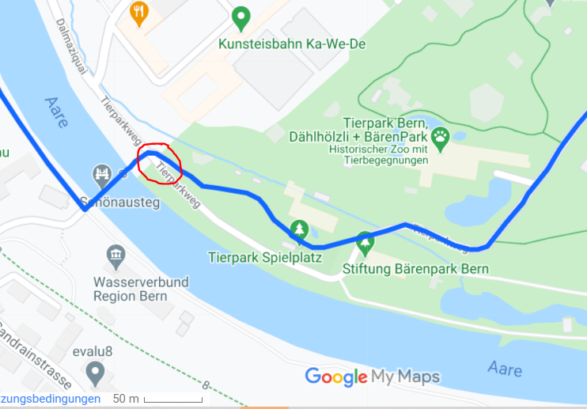

+++
title = "Jogging "
date = "2021-03-31"
draft = false
pinned = false
description = "Wir waren heute eine Joggingroute für einen andere Gruppe testen. "
+++
Heute sind wir die Jogging-Route von einer anderen Gruppe gelaufen. Wir konnten es uns zeitlich einrichten, da aktuell die Länderspielpause ist. Wir bekamen den Auftrag die Route die uns auf dem Mail gesendet wurde abzulaufen und zu schauen ob alles funktioniert und klar ist. Im Bild unterhalb sehen Sie die Route die wir machten. 

Zuerst möchte ich erwähnen, dass das System mit dem QR-Code auf meinem Gerät nicht funktioniert hat. Ich konnte es als einziger Testen da die anderen Gruppenmitglieder kein unbeschränktes Datenvolumen haben. Ich weiss nicht ob es an der Android-Software liegt oder an etwas anderem. Wir liessen uns aber nicht aufhalten und joggten los...

Wir begannen bei der Zytglogge und joggten durch die Stadt bis wir an der Aare waren. Wir machten eine kurze Verschnaufpause und liegen dem Fluss entlang. Das Wetter war wunderbar wenn nicht sogar fast zu heiss, aber trotzdem konnten wir uns keine längere Pause gönnen. 

Nachdem wir den Schönausteg überquerten, haben wir uns zuerst ein wenig verlaufen. Wir haben den kleinen Weg oberhalb des Tierparkweges nicht gesehen. Als uns auffiel, dass die Route nicht ganz stimmen kann, haben wir die Karte erneut betrachtet Wechselten auf den namenlosen Weg und joggten weiter (rot umkreist im Bild) 

Das war aber auch die einzige Unklarheit die uns bei der Route aufgefallen ist. 

Meiner Meinung nach ist die Route sehr abwechslungsreich von den Landschaften her und bei einem solchen Wetter wie heute einfach fabelhaft. Man muss aber noch festhalten, dass es in der Innenstadt nicht optimal ist zum joggen, da der Untergrund hart und nicht immer eben ist. Aber für die schöne Strecke lohnt es sich, trotzdem durchzuziehen. 

Ich denke wenn man das Problem mit den QR-Codes beheben könnte und die Karte an der genannten Stelle überarbeiten oder verdeutlichen würde könnte man mit dem Projekt durchstarten.