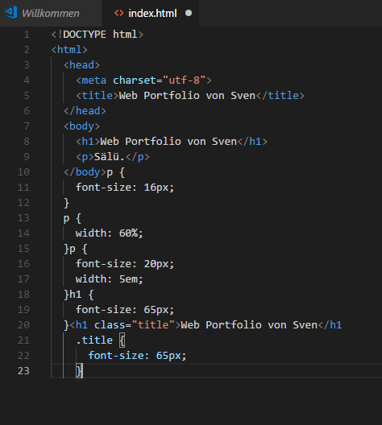

+++
title = "P&P Programmieren und Projekt "
date = "2020-11-11"
draft = false
pinned = false
image = "web_programmieren3.png"
description = "Ich habe heute programmiert und unser Projekt vorangebracht."
+++
Wir konnten verschiedene Befehle von einer Webseite aus dem Internet kopieren und in unser Programm einfügen. Den Text konnten wir dann individuell bearbeiten und auf unsere Persönlichkeit anpassen. 

Im zweiten Teil konnten wir an unseren Projekten arbeiten. Wir fuhren mit der Planung fort. Am Ende hatten wir noch Zeit unsere Webseiten voranzubringen.

