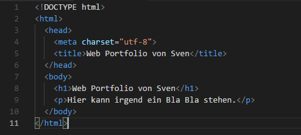

+++
title = "Programmieren"
date = "2020-11-04"
draft = true
pinned = false
image = "web_programmieren.jpg"
description = "Wir haben heute programmiert."
+++
Ich habe heute in der Schule angefangen zu programmieren. Ich musste eine Datei auf die Festplatte runterladen und danach öffnete sich ein Programm. 

Wir konnten gewisse Funktionen aus einer Vorgabe kopieren und in dem Programm eintragen. Ich hatte noch keine Erfahrungen mit programmieren und wusste darum auch nicht unbedingt für was die Zahlen und Sätze stehen.

Ich muss sagen, dass mir das Programmieren spass gemacht hat, aber ich würde mich lieber weiter auf unser Projekt fokussieren.

