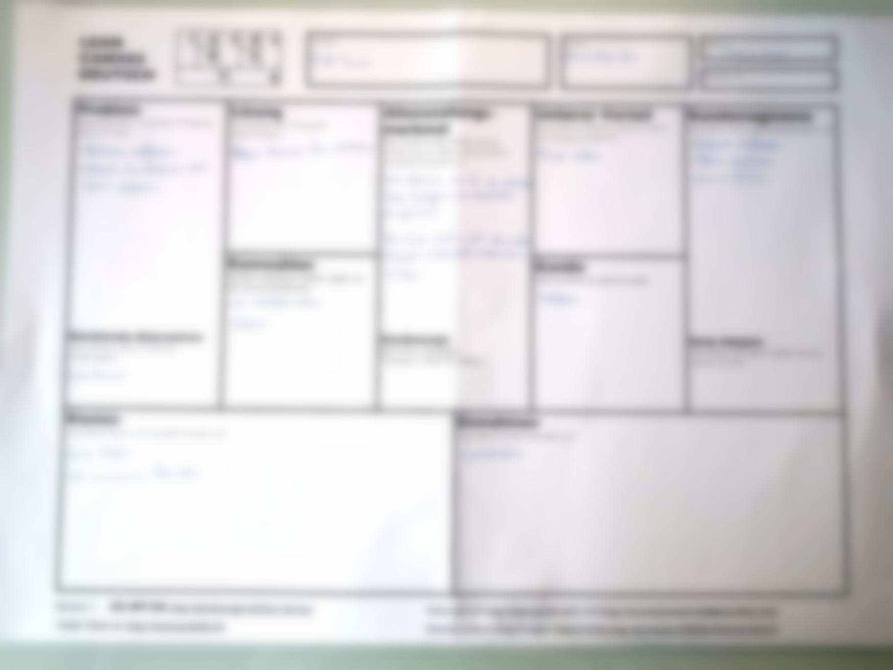

+++
title = "Projekt: Instagram "
date = "2021-02-03"
draft = false
pinned = false
image = "old-instagram-logo.jpg"
+++
Am 3. Februar arbeiteten wir von zuhause aus. Wir wollten mit unserem neuen Projekt beginnen. Dazu mussten wir zuerst die CANVAS-Vorlage ausfüllen. Wir füllten diese einzeln aus und besprachen sie im Anschluss gemeinsam. Danach erkundigten wir uns, wie man bei unserem neuen Projekt vorgeht. Aus Datenschutzgründen haben wir diese zensiert. 

\
Das neue Projekt::

\
Wir trafen uns in den letzten zwei Wochen mit einem Spieler vom Fussballclub Zollikofen und stellten ihm unsere Webseite aus dem ersten Semester. Diese konnte aber den Wunsch unseres Kunden nicht erfüllen, da der Fussballclub eher an Reichweite interessiert wäre. Also haben wir uns darauf geeinigt, dass wir im zweiten Semester im WEB einen Instagram-Account erstellen und führen.\
\
Da im Moment aufgrund von Corona nicht gespielt wird, ist es eine gute Gelegenheit für uns, erste Schritte zu wagen. Wir wollen eine gute Basis bilden, um später während der Saison darauf aufbauen zu können. 

Wir werden aber auf keinen Fall unsere Web-Seite mit den Resultaten vernachlässigen. 

