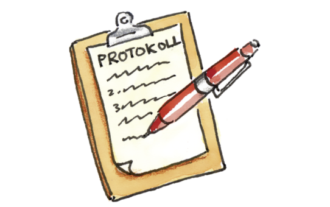

+++
title = "Protokoll"
date = "2020-09-09"
draft = false
pinned = false
image = "web-protokoll.jpg"
description = "Wie schreibe ich ein Protokoll?"
+++

Was muss in einem Protokoll sein?

\- Datum und Uhrzeit

\- Ort der Sitzung

\- Die wichtigsten Punkte festhalten

\- Unterschrift

Diese Punkte müssen in jedem Protokoll vorhanden sein!